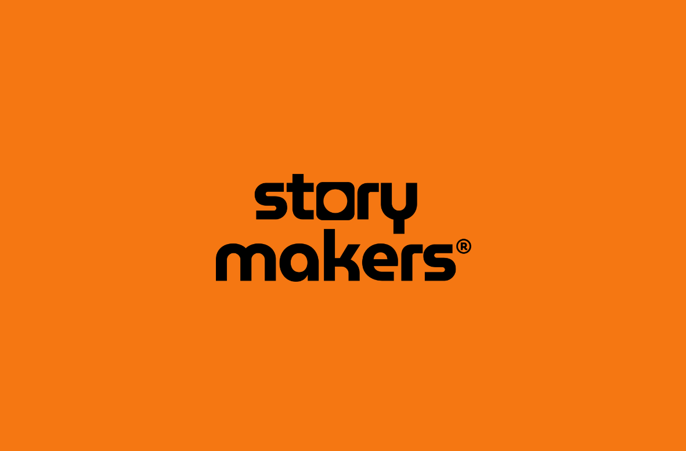
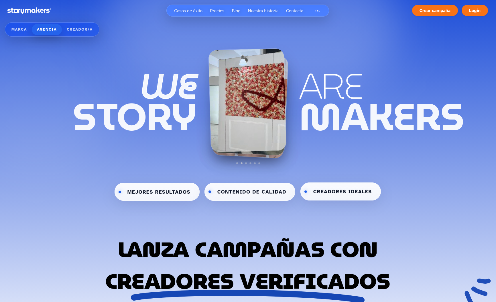
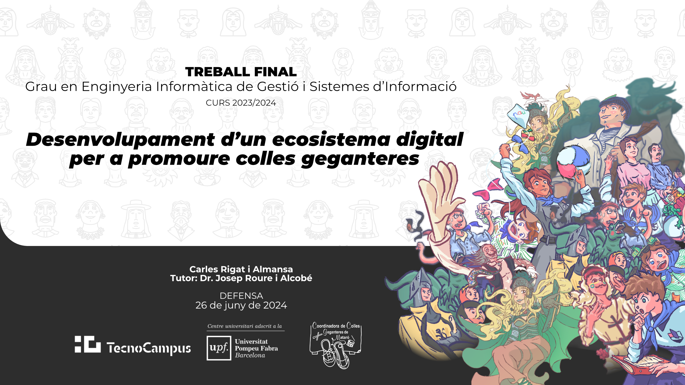
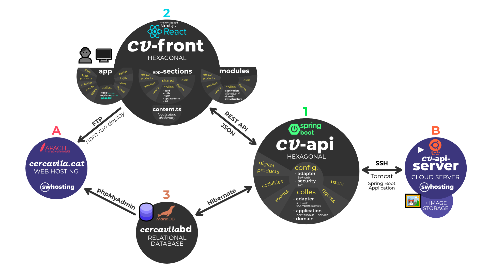
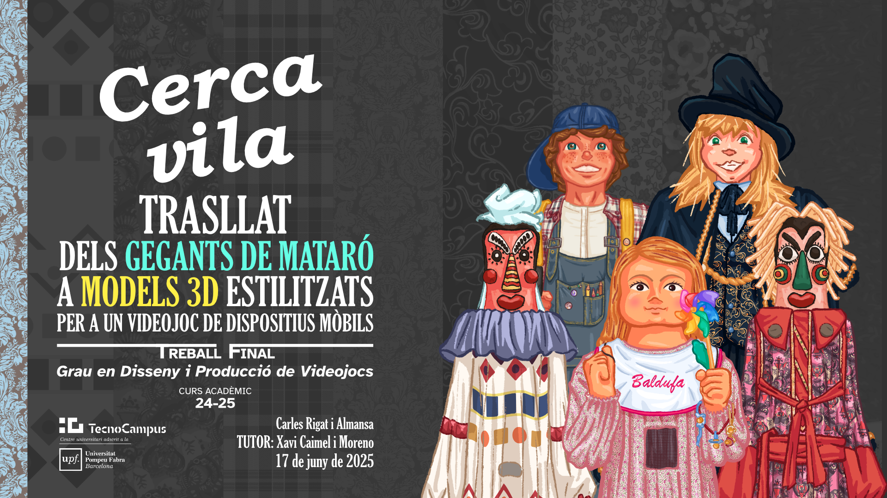

<b>BACKEND SOFTWARE ENGINEER</b> · Barcelona

<!-- one-line tagline, adapt from the CV summary's spirit (not verbatim) -->

<i>Designing, building and running live web applications — backend-focused, full-stack fluent.</i>

<!-- optional single hero identity row; keep to a handful, not your whole stack -->

  
  
  
  

---

## About

Managing and leading tech teams, working for
interdisciplinary environments to reach their organisational goals. Finished a double degree in Software Engineering and
Game Development, worked in enterprise consulting and grew a startup product as its technical lead.
Focused on backend engineering, fluent across the full stack and creative work.

---

## Featured Projects

<table>
  <tr>
    <td width="33%" align="center">
      <a href="https://www.storymakers.es/">
         
        <b>Storymakers</b>
      </a> 
      Production web platform · CTO &amp; Founding Engineer, team management and system maintenance.   
      <a href="assets/image_storymakers.png">
         
      </a> 
      <a >
        <b></b>
      </a> 
      <a >
        <b></b>
      </a> 
      <a >
        <b></b>
      </a> 
    </td>
    <td width="33%" align="center">
      <a href="docs/defensa_crigat_tfg_inf_ecosistema_digital.pdf">
         
        <b>Full-stack web platform</b>
      </a> 
      Hexagonal backend, multi-role frontend, multimedia management and deployment.   
      <a href="assets/image_engineering.png">
         
      </a> 
      <a href="docs/carlesRigatAlmansa_memoriaTFGInfo_ecosistemaDigital.pdf">
        <b>Paper</b>
      </a> 
      <a href="docs/carlesRigatAlmansa_annexosTFGInfo_ecosistemaDigital.pdf">
        <b>Appendix</b>
      </a> 
      <a href="docs/defensa_crigat_tfg_inf_ecosistema_digital.pdf">
        <b>Slides</b>
      </a> 
    </td>
    <td width="33%" align="center">
      <a href="docs/defensa_crigat_tfg_gdpv_trasllatGegantsMataro.pdf">
         
        <b>Characters and physics</b>
      </a> 
      Academic research, project planning, cloth rig and physics simulation, 2D and 3D art, Unity mobile app.   
      <a href="assets/cover_video_games.png">
         
      </a> 
      <a href="docs/crigat_memoriafinalTFG_GDPV_gegantsMataro.pdf">
        <b>Paper</b>
      </a> 
      <a href="docs/crigat_annexosTFG_GDPV_gegantsMataro.pdf">
        <b>Appendix</b>
      </a> 
      <a href="docs/defensa_crigat_tfg_gdpv_trasllatGegantsMataro.pdf">
        <b>Slides</b>
      </a> 
    </td>
  </tr>
</table>

<!-- optional: a collapsible "more projects" block so the page stays short -->

<b>More projects</b>

- **eCommerce development** (2022) — one built from scratch (Java, Spring Boot, JavaScript, RESTful APIs), one integrating Shopify &amp; Joomla.
- **Rise of the Hidden Pyramid · Nohllic Wars** (2022–2024) — shipped Unity titles: programming, 2D/3D art, QA. → [itch.io](https://rigat13.itch.io)

---

## Skills

**Languages**  

 
**Backend**  

-informational?style=flat-square&logo=junit5&logoColor=white&color=1c1c1a)
 
**Data**  

 
**Infrastructure**  

-informational?style=flat-square&logo=ubuntu&logoColor=white&color=1c1c1a)

 
**Methods**  

 
**Design / Game**  

---

## Recognition

<!-- Static-label badges (no logo). Underscores render as spaces. Content lifted from the CV. -->

**Education** — Double Bachelor's Degree: Computer Engineering and Management of Information Systems + Video Game Design and Production · 23 top-grade distinctions · Simultaneous dual enrolment, 362 ECTS · TecnoCampus (UPF), 2019–2025.

---

## Languages

-1c1c1a?style=flat-square)

---

## Links

  
  
  

